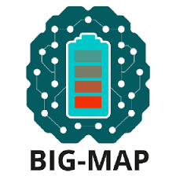

# AiiDAlab Quantum ESPRESSO application

[](https://codecov.io/gh/aiidalab/aiidalab-qe)
[](https://aiidalab-qe.readthedocs.io/?badge=latest)

## About

This is an AiiDAlab application for Quantum ESPRESSO workflows.
The app allows the execution of a workflow with Quantum ESPRESSO that includes the selection of an input structure, its relaxation, the bands structure calculation, and more!

**The app is currently in an early development stage!**

## For developers

The package uses pre-commit hooks to check the style consistency of all commits.
To use those you need to first install the pre-commit package itself, e.g. with:
```
pip install .[dev]
```
and then install the pre-commit hooks with
```
pre-commit install
```
The pre-commit checks should now be automatically executed prior to each commit.

To run unit tests in the AiiDAlab container, you need to run `pytest` from within the `aiida-core-services` conda environment:
```
conda activate aiida-core-services
pytest -sv tests
```

To run the integration tests, you need to build the Docker image first:

```
docker build . -t aiidalab/qe
```

Then, you can run the integration tests with:

```bash
pytest --driver Chrome tests_integration
```

### Published Docker images

Supported tags released on [Github Container Registry](https://ghcr.io/aiidalab):

- `edge` – the latest commit on the default branch (`main`)
- `latest` – the latest stable release
- `$version` – the version of a specific release (ex. `2022.1001`)

Pull requests into the default branch are further released on ghcr.io with the `pr-###` tag to simplify the testing of development versions.

## For maintainers

To create a new release, clone the repository, install development dependencies with `pip install '.[dev]'`, and then execute `bumpver update`.
This will:

  1. Create a tagged release with bumped version and push it to the repository.
  2. Trigger a GitHub actions workflow that creates a GitHub release.

For more details of the releases plan and management, please go to [the wiki](https://github.com/aiidalab/aiidalab-qe/wiki/Releases-management).

Additional notes:

  - Use the `--dry` option to preview the release change.
  - The release tag (e.g. a/b/rc) is determined from the last release.
    Use the `--tag` option to switch the release tag.
  - For making "outdated" release since we fix minor version to `2x.04.xx` and `2x.10.xx`, use e.g. `bumpver update --set-version v23.10.0rc4 --ignore-vcs-tag` to make the release.

## Acknowledgements
We acknowledge support from:
* [MARVEL National Centre for Competency in Research](https://nccr-marvel.ch/) funded by the [Swiss National Science Foundation](https://www.snf.ch/en).
* [BIG-MAP project](https://www.big-map.eu) funded by the Horizon 2020 research and innovation programme (Grant No. 957189).
* [MARKETPLACE project](https://www.the-marketplace-project.eu/) funded by Horizon 2020 under the H2020-NMBP-25-2017 call (Grant No. 760173).
* [MaX European Centre of Excellence](https://www.max-centre.eu/) funded by the Horizon 2020 EINFRA-5 program (Grant No. 676598).
* [DOME 4.0 project](https://dome40.eu/) funded by the EU Horizon 2020 Research and Innovation Programme (Grant No. 953163)


<div style="display: flex; flex-wrap: wrap; justify-content: space-around; align-items: center; gap: 50px; text-align: center;">
 
 
 
 
 
 
</div>
