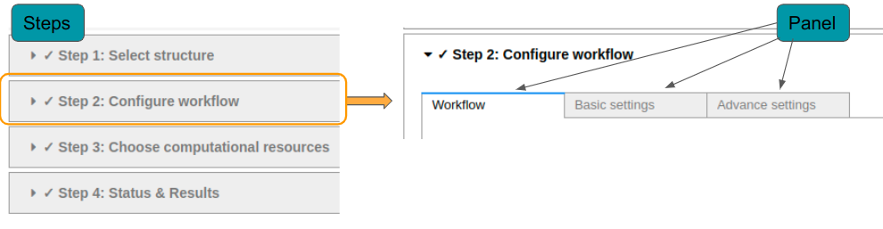
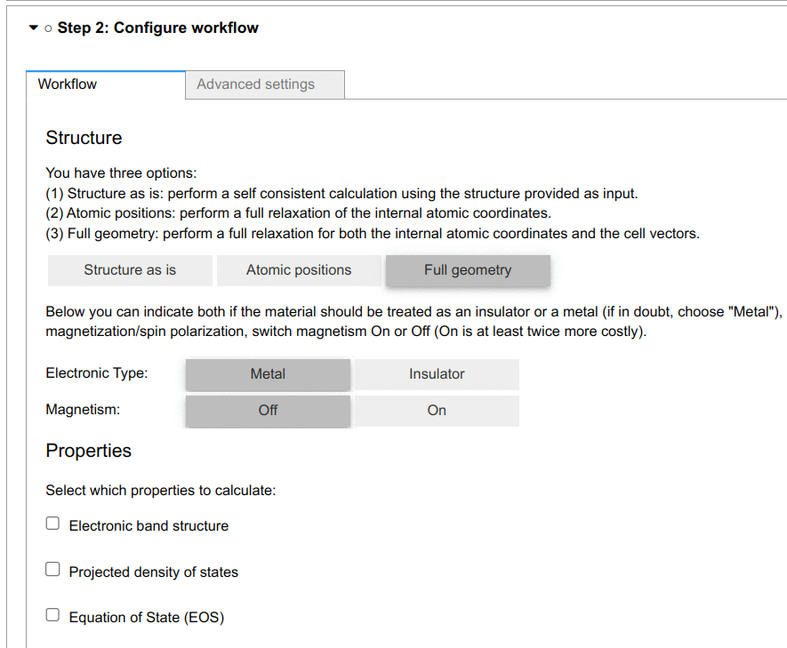

.. _develop:architecture:

************************
Architecture
************************

Wizards-like UI
================

QuantumESPRESSO app uses the `Wizards-like UI design <https://en.wikipedia.org/wiki/Wizard_(software)>`_, which divides one calculation into four steps.
Each step may contain several sections (panels), as shown in the figure below.

MVC design
==========

The app is designed following a Model-View-Controller (MVC) pattern, with data managed solely by the model network (the source of truth).

A simple model may look like the following:

.. code:: python

    class SimpleModel(tl.HasTraits):

        # Define traits
        trait = tl.Unicode("I am a trait")  # `tl` is alias for `traitlets`
        ...

        def __init__(self, *args, **kwargs):  # Optional, only if required
            super().__init__(*args, **kwargs)

            # Optional attributes can be defined here

        def reset(self):
            # Reset the model to its defaults

The corresponding View-Controller may look like this:

.. code:: python

    class SimpleWidget(ipw.VBox):
        def __init__(self, model=SimpleModel, **kwargs):
            from aiidalab_qe.common.widgets import LoadingWidget

            super().__init__(
                children=[LoadingWidget("Loading message")],  # loading spinner icon
                **kwargs,
            )

            self._model = model

            # Contoller observations of model changes
            self._model.observe(
                self._on_trait_change,
                "trait",
            )
            ...

        # View
        def render(self):
            if self.rendered:
                return

            # Define and link widgets
            widget = ipw.Dropdown(description="Trait")
            ipw.dlink(
                (self._model, "options"),
                (widget, "value"),
            )
            ipw.link(
                (self._model, "trait"),
                (widget, "value"),
            )
            ipw.dlink(
                (self._model, "override"),
                (widget, "disabled"),
                lambda override: not override,
            )
            ...

            self.children = [
                widget,
                ...
            ]

            self.rendered = True

        # Controller methods
        # EXAMPLE
        def _on_trait_change(self, change):
            # Update widgets based on model changes
            ...

MVC in the configuration step
-----------------------------

Some models require additional functionality, particularly in the configuration step (step 2), where many MVC components come together to form the
UI for specifying both the workflow and its input.
Each of these is defined as a ``SettingsPanel`` with a corresponding ``SettingsModel``.
Some of these are defined in the app, such as the basic and advanced settings panels.
For dedicated calculations (e.g. bands, pdos, xps), they are defined externally as :ref:`plugins <develop:plugins>`.

Below are snippets of the ``AdvancedModel`` and ``AdvancedSettings`` classes:

.. code:: python

    class AdvancedModel(
        SettingsModel,
        HasModels[AdvancedSubModel],
        HasInputStructure,
    ):
        dependencies = [
            "input_structure",
            "workchain.protocol",
            ...
        ]

        protocol = tl.Unicode()

        kpoints_distance = tl.Float(0.0)
        ...

        self.include = True  # includes this model in the configuration step

        # Optional attributes can be defined here
        self.dftd3_version = {
            ...
        }

        def update(self, specific=""):
            # Update the model, optionally limited to a specific scope
            ...

        def get_model_state(self) -> dict:
            # Return the model state as a dictionary
            ...

        def set_model_state(self, parameters: dict):
            # Set the model state from a parameters dictionary
            # Used when loading a previous calculation
            ...

        def reset(self):
            # Reset the model to its defaults
            ...

Model updates recompute trait defaults w.r.t dependent traits (e.g. input structure, protocol) and update the model's traits to these defaults.
The defaults are stored in a ``_defaults`` dictionary that is used in ``reset`` to return the model to its *current* defaults.
The dependencies of a model are defined in the ``dependencies`` list, which is used by in configuration step during plugin discovery to connect the model network.
The inter-connection of dependency traits forms an **Observer** pattern across the app, with each dependent model receiving notifications of state changes in dependencies.
When a calculation is submitted, the configuration step will collect the parameters from all *included* models (``include == True``) and pass them to the submit step.

.. note:: The basic and advanced models are included by default. Inclusion of installed plugin models is controlled by the user in step 2.1.

.. warning:: The ``default_value`` of ``List`` or ``Dict`` traits is not stored by ``traitlets``.
    Instead, explicitly define the defaults to at least ``[]`` or ``{}``, respectively.

.. code:: python

    class AdvancedSettings(SettingsPanel[AdvancedModel]):
        title = "Advanced Settings"
        identifier = "advanced"

        def __init__(self, model: AdvancedModel, **kwargs):
            super().__init__(
                model=model,
                layout={"justify_content": "space-between", **kwargs.get("layout", {})},
                **kwargs,
            )

            self._model.observe(
                self._on_input_structure_change,
                "input_structure",
            )
            ...

            # Optionally connect sub-MVC components
            smearing_model = SmearingModel()
            self.smearing = SmearingSettings(model=smearing_model)
            model.add_model("smearing", smearing_model)
            ...

        def render(self):
            if self.rendered:
                return

            # Define and link widgets
            ...

            self.children = [
                ...
            ]

            self.rendered = True

.. note:: The generic type ``AdvancedModel`` in ``SettingsPanel[AdvancedModel]`` is used to specify the model type, which is used to infer the type of the model in the class and provide type hinting in modern IDEs.

Mixins
------

The ``HasModels`` mixin class inherited by the ``AdvancedModel`` is used to manage sub-models.
It provides functionality to add, register, and get a sub-model.
It is presently used by the configuration step to register basic, advanced, and plugin models.
It is also used by the advanced panel to register the sub-sections of the advanced settings (e.g. magnetization, hubbard, etc.).

Other mixins, such as ``HasInputStructure``, provide are trait oriented, providing both the trait and methods to work with it.
The ``Confirmable`` mixin, for example, provides a ``confirmed`` trait, a ``confirm`` method, and an means of un-confirming on any state change in the inheriting model.

.. code:: python

    class Confirmable(tl.HasTraits):
        confirmed = tl.Bool(False)

        def confirm(self):
            self.confirmed = True

        @tl.observe(tl.All)
        def _on_any_change(self, change):
            if change and change["name"] != "confirmed":
                self._unconfirm()

        def _unconfirm(self):
            self.confirmed = False

App status
==========

To keep track of the status of the app at any given step, a ``state`` trait of a step is linked with the ``previous_step_state`` trait of its following step. A ``SUCCESS`` state is used to auto-proceed to a following step.
The ``state`` trait is updated on most events.

.. code:: python

    ipw.dlink(
        (self.structure_step, "state"),
        (self.configure_step, "previous_step_state"),
    )

Data management across steps
============================

Data is passed to the next step by use of ``App``-level controller observations of step (un)confirmation following the **Mediator** pattern, as follows:

- Step 1 confirmed -> triggers setting of ``input_structure`` in step 2
- Step 2 confirmed -> triggers setting of ``input_structure`` and ``input_parameters`` in step 3
- Step 3 submitted -> triggers setting of ``process.uuid`` in step 4

.. note:: In the observers of step 1 and 2, ``_update_blockers()`` is also triggered to identify any current blockers to submission.
    These blockers are linked with the submission model, which is used to show any submission warnings in step 3.

In confirming step 2, the configuration step collects the parameters from all included models and returns them as a dictionary of the following format:

.. code:: python

    {
        "workchain": {
            "protocol": "fast",
            "relax_type": "positions",
            "properties": ["bands", "pdos", "relax"],
            "spin_type": "none",
            "electronic_type": "insulator",
        },
        "advanced": {
            "initial_magnetic_moments": None,
            "pw": {
                "parameters": {
                    "SYSTEM": {"ecutwfc": 30.0, "ecutrho": 240.0, "tot_charge": 0.0}
                },
                "pseudos": {"Si": "eaef3352-2b0e-4205-b404-e6565a88aec8"},
            },
            "pseudo_family": "SSSP/1.3/PBEsol/efficiency",
            "kpoints_distance": 0.5,
        },
        "bands": {},
        "pdos": {...},
        "plugin_1": {...},
        "plugin_2": {...},
    }

.. _develop:plugins:

Plugins
=======

The Quantum ESPRESSO app supports computing multiple properties (bands, pdos, etc.).
For this, plugins are to be developed and seamlessly integrated into the app.
The integration is made possible by several key aspects:

- The configuration settings for a property calculation must be decoupled from any other plugin - no cross-dependency
- The sub-workchain of a property can be run independently
- The analysis of the results of a property is independent

Each plugin is responsible for the calculation of a single property.
For instance, we could create a PDOS plugin, including its settings, workchain, and result analysis.

.. TODO modify below
The GUI of the PDOS plugin is only loaded when the user selects to run it.
Here is an example, where two new setting panels are shown when the user selects to run the properties.

A QuantumESPRESSO app plugin will typically register new panels (setting, result), and workchain to extend the functionality of the app.
The plugin design makes the QuantumESPRESSO app more modularized and pluggable.
Consequently, developers have the flexibility to manage their plugins in a distinct folder within the QuantumESPRESSO application's codebase, or they may choose to maintain it as an independent package.
