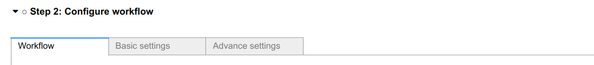

.. _develop:architecture:

************************
Architecture
************************

Wizards UI
==========

QuantumESPRESSO app uses the Wizards UI, which divides one calculation into four steps.
Each step may contain several sections (panels), as shown below.

.. image:: ../_static/images/plugin_step.png

Parameter transfer between steps
---------------------------------

The data is passed to the next step by linking it to the corresponding ``trail`` of the step.
For example, the ``confirmed_structure`` of step 1 is linked to the ``input_structure`` ``trail`` of step 2.

.. code:: python

    ipw.dlink(
            (self.structure_selection_step, "confirmed_structure"),
            (self.configure_qe_app_work_chain_step, "input_structure"),
        )

In the configuration step, there are several panels.
The parameters from these panels are generated and stored as a dictionary,
which is linked to the ``input_parameters`` ``trail`` of the next submit step.
The dictionary has the following structure:

.. code:: python

    {
        "workchain": {
            "protocol": "fast",
            "relax_type": "positions",
            "properties": ["bands", "pdos", "relax"],
            "spin_type": "none",
            "electronic_type": "insulator",
        },
        "advanced": {
            "initial_magnetic_moments": None,
            "pw": {
                "parameters": {
                    "SYSTEM": {"ecutwfc": 30.0, "ecutrho": 240.0, "tot_charge": 0.0}
                },
                "pseudos": {"Si": "eaef3352-2b0e-4205-b404-e6565a88aec8"},
            },
            "pseudo_family": "SSSP/1.2/PBEsol/efficiency",
            "kpoints_distance": 0.5,
        },
        "bands": {"kpath_2d": "hexagonal"},
        "pdos": {...},
        "plugin_1": {...},
        "plugin_2": {...},
    }

Plugin
======

QuantumESPRESSO app supports running multiple properties (bands, pdos, etc.) calculations in one app.
Please take into account the following facts:

- the configuration for a property calculation has its settings unrelated to other properties.
- the sub-workchain of the properties can be run independently.
- the analysis of the results of the properties is also independent.

Thus, we can develop a property separately and integrate it into the QuantumESPRESSO app as a plugin.
Each plugin responsible for one property calculation.
For example, we could create a PDOS plugin, including its settings, workchain, and result analysis.
The GUI of the PDOS plugin is only loaded when the user selects to run the PDOS property.
Here is an example, where two new setting panels are shown when the user selects to run the properties.

A QuantumESPRESSO app plugin will typically register new panels (setting, result), and workchain to extend the app's functionality.
The plugin design makes the QuantumESPRESSO app more modularized and pluggable.
So the developer can maintain their plugin as a separate folder in the QuantumESPRESSO app (even a separate package).
