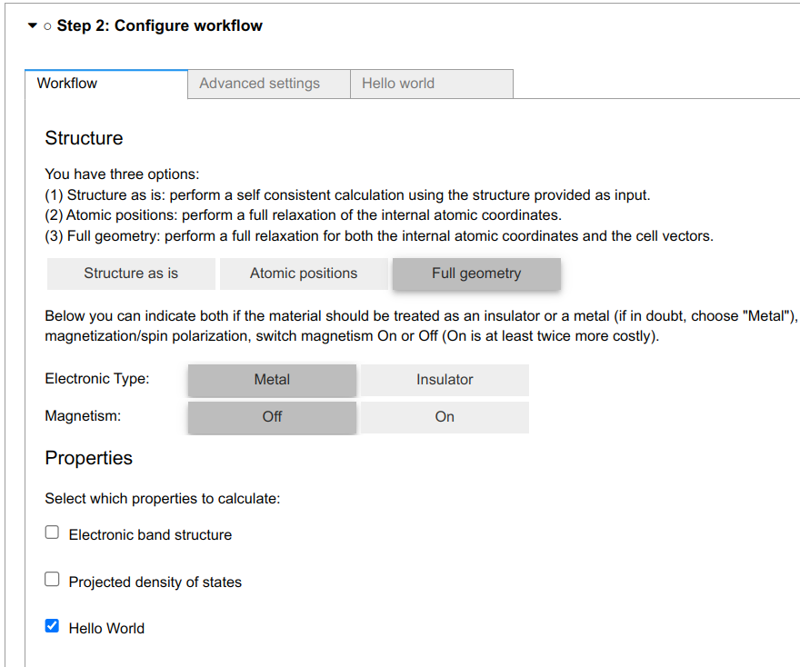
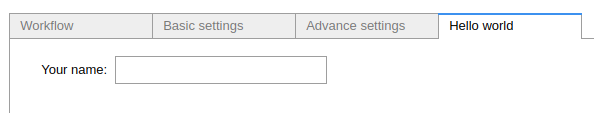
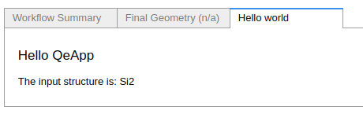

.. _develop:create-plugin:

************************
Create your plugin
************************

A QeApp plugin will typically register new panels (setting, result), and workchain to extend the app's functionality.

Your First Add-on
================================

Here is the simplest plugin to print the formula of the input structure:

Outline
-----------------------
A  :class:`~aiidalab_qe.common.panel.Outline` will add a item in the properties section of the workflow panel. For this example we'll add the ``Hello World`` item, as shown below.

The **Outline** will be shown as a checkbox.

.. code-block:: python

    from aiidalab_qe.common.panel import OutlinePanel

    class Outline(OutlinePanel):
        title = "Hello World"

Setting
-----------------------
A  :class:`~aiidalab_qe.common.panel.Panel` will register a new panel in the configuration Step, e.g. the ``Hello workd`` panel.

In this class, one can add widgets (e.g, Float, Int) to the GUI. The values of these widgets will be used in the WorkChain. One needs to override the ``get_panel_value`` method to tell QeApp how to use the values from the widgets. One also need to override the ``set_panel_value`` method to tell QeApp how to reload the panel values from previous calculation, and the ``reset`` method to reset the panel to the default values.

.. code-block:: python

    from aiidalab_qe.common.panel import Panel

    class Setting(Panel):
        """"""
        title = "Hello world"

        def __init__(self, **kwargs):
            self.name = ipw.Text(value="", description="Your name:")
            self.children = [self.name]
            super().__init__(**kwargs)

        def get_panel_value(self):
            """Get the panel value"""
            return {"name": Str(self.name.value)}

        def set_panel_value(self, input_dict):
            """Set the panel value"""
            self.name.value = input_dict.get("name", 1)

        def reset(self):
            """Reset the panel"""
            self.name.value = ""

Result
-----------------------
A  :class:`~aiidalab_qe.common.panel.ResultPanel` will register a new panel in the Results Step, e.g. the ``Hello workd`` panel.

In this class, one needs to implement the ``_update_view`` method to tell QeApp how to show the results of the workchain. The output of the workchain will be stored in ``self.outputs``. For example, the ``name`` and ``structure`` are the outputs of the ``HelloWorldWorkChain``.

.. code-block:: python

    from aiidalab_qe.common.panel import ResultPanel

    class Result(ResultPanel):
        title = "Hello world"
        workchain_label = "hello_world"

        def _update_view(self):
            name = self.outputs.name.value
            formula = self.outputs.structure.get_formula()
            self.summary_view = ipw.HTML(
                f"""
 <h4>Hello {name}</h4> The input structure is: {formula} 
""".format()
            )
            self.children = [ipw.HBox(children=[self.summary_view])]

WorkChain and Builder
-----------------------
One needs to implement a ``get_builder`` function to tell QeApp how to use the input parameters from the GUI.

The `parameters` passed to the `get_builder` function has the following structure:

.. code:: python

    {
        "workchain": {
            "protocol": "fast",
            "relax_type": "positions",
            "properties": ["bands", "pdos", "relax"],
            "spin_type": "none",
            "electronic_type": "insulator",
        },
        "advanced": {
            "initial_magnetic_moments": None,
            "pw": {
                "parameters": {
                    "SYSTEM": {"ecutwfc": 30.0, "ecutrho": 240.0, "tot_charge": 0.0}
                },
                "pseudos": {"Si": "eaef3352-2b0e-4205-b404-e6565a88aec8"},
            },
            "pseudo_family": "SSSP/1.2/PBEsol/efficiency",
            "kpoints_distance": 0.5,
        },
        "bands": {"kpath_2d": "hexagonal"},
        "pdos": {...},
        "hello_world": {...},
        "plugin_1": {...},
    }

One needs to decide which parameters are needed for the workchain, and how to use them. For example, the ``HelloWorldWorkChain`` needs the ``name`` parameter, which is defined in the ``Setting`` panel. The ``get_builder`` function will return a ``builder`` for the ``HelloWorldWorkChain``. The ``builder`` will be used to submit the workchain.

.. code-block:: python

    def get_builder(codes, structure, parameters):
        """Get the workchain specific parameters
        """
        parameters = parameters.get("hello_world", {})
        builder = HelloWorldWorkChain.get_builder_from_protocol(
                    codes=codes,
                    structure=structure,
                    parameters=parameters,
                )
        return builder

Then register the workchain and builder in the `workchain_and_builder` dict, so that the QeApp can load them.

.. code-block:: python

    # register the workchain and builder
    workchain_and_builder = {
        "workchain": HelloWorldWorkChain,
        "get_builder": get_builder,
        }

Entry point
-----------------------
Finally, one needs to register the entry point of the plugin. Here is the entry point for this plugin.

.. code-block:: python

    # this is the entry point of the plugin
    hello_world ={
    "outline": Outline,
    "setting": Setting,
    "workchain": workchain_and_builder,
    "result": Result,
    }

One needs to add the path of ``hello_world`` to ``entry_points`` inside the setup file.

.. code-block:: python

    entry_points={
            "aiidalab_qe.properties": [
                "hello_world = aiidalab_qe_hello_world:hello_world",
            ],
        },

Note: one plugin does not need to register all the items (settings, workchain, results). The panel in each step is pluggable, which means you could only register one item in a plugin. For example, you can only add a new `Result` panel without doing any property calculation.

You can add this plugin as a folder in the QeApp package, or create a new package for it.

**Bringing It All Together**, You can find all the code above in this github repository: https://github.com/superstar54/aiidalab-qe-hello-world

QeApp comes with built-in plugins, which can be found in the ``aiidalab_qe`` package. You can also use them as examples to create your own plugins.
