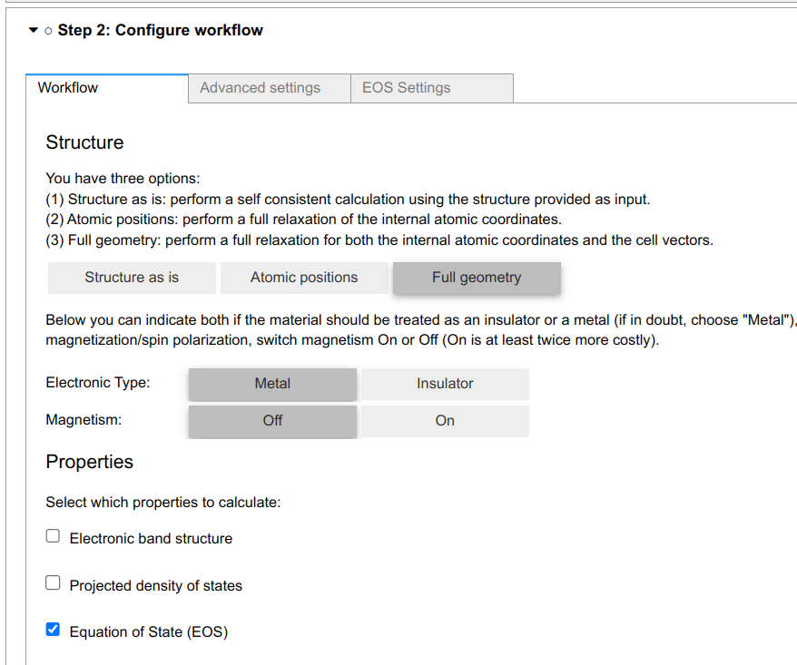

.. _develop:create-plugin:

************************
Create your plugin
************************

A QuantumESPRESSO app plugin will typically register new panels (setting, result), and workchain to extend the app's functionality.

Your First Plugin
================================

Here is the an example plugin to calculate the equation of state (EOS) of a material.
This plugin will register the following items:

- Outline
- Setting
- Result
- Workchain

Let's go through each item in detail.

Outline
-----------------------
A  :class:`~aiidalab_qe.common.panel.Outline` widget can add an item, as a checkbox, in the properties section of the workflow panel in the configuration step.
You only need to set the title of the outline.

.. code-block:: python

    from aiidalab_qe.common.panel import OutlinePanel

    class EosOutline(OutlinePanel):
        title = "Equation of State (EOS)"

The ``EOS`` outline is shown below.

Setting
-----------------------
A setting :class:`~aiidalab_qe.common.panel.Panel` widget will register a new panel in the configuration step, e.g. the ``EOS setting`` panel.

.. image:: ../_static/images/plugin_setting.png

In this panel, you can add widgets to set the input parameters for the plugin's WorkChain.
For example, a ``FloatText`` widget to set the scale of the structure, and a ``IntText`` widget to set the number of points.
Beside, you need to override the the following methods:

- ``get_panel_value`` to tell the app how to get the values from the widgets.
- ``set_panel_value`` to tell the app how to reload the panel values from the previous calculation.
- ``reset`` to reset the panel to the default values.

.. code-block:: python

    import ipywidgets as ipw
    from aiidalab_qe.common.panel import Panel

    class Setting(Panel):

        title = "EOS Settings"

        def __init__(self, **kwargs):
            self.settings_title = ipw.HTML(
                """

                <h4>Settings</h4>
"""
            )
            self.settings_help = ipw.HTML(
                """

                Please set the value of scale and number of points.
                
"""
            )
            self.scale = ipw.FloatText(
                value=0.05,
                description="Scale:",
                disabled=False,
                style={"description_width": "initial"},
            )
            self.npoint = ipw.IntText(
                value=5,
                description="Npoint:",
                disabled=False,
                style={"description_width": "initial"},
            )

            self.children=[
                    self.settings_title,
                    self.settings_help,
                    self.scale,
                    self.npoint,
                ]
            super().__init__(**kwargs)

        def get_panel_value(self):
            """Return a dictionary with the input parameters for the plugin."""
            return {
                "scale": self.scale.value,
                "npoint": self.npoint.value,
            }

        def set_panel_value(self, input_dict):
            """Set the value of the widgets in the panel from the input dictionary.
            This method is called when the user wants to reload the panel from the previous calculation,
            or reset the panel to the default values."""
            self.scale.value = input_dict.get("scale", 0.05)
            self.npoint.value = input_dict.get("npoint", 5)

        def reset(self):
            """Reset the input fields."""
            self.set_panel_value({"scale": 0.05, "npoint": 5})

Result
-----------------------
A  :class:`~aiidalab_qe.common.panel.ResultPanel` widget will register a new panel in the results step.
The ``EOS`` panel is shown below:

.. image:: ../_static/images/plugin_result.png

In this widget, you need to:

- specify the `workchain_labels` to tell the app which workchains the panel is intended for.
- implement the ``_update_view`` method to tell the app how to show the results of the workchain.

The output of the workchain will be stored in ``self.outputs.plugin_name``.
For example, you can access the ``output_parameters`` output of the ``EOSWorkChain`` by ``self.outputs.eos.output_parameters``.

.. code-block:: python

    from aiidalab_qe.common.panel import ResultPanel
    import ipywidgets as ipw

    class Result(ResultPanel):
        title = "EOS"
        workchain_labels = ["eos"]

        def __init__(self, node=None, **kwargs):
            super().__init__(node=node, identifier="eos", **kwargs)

        def _update_view(self):
            import plotly.graph_objects as go
            from ase.eos import EquationOfState
            # init figure
            g = go.FigureWidget(
                layout=go.Layout(
                    title=dict(text="Equation of State"),
                    barmode="overlay",
                )
            )
            g.layout.xaxis.title = "Volume (A^3)"
            g.layout.yaxis.title = "Energy (eV)"
            # get the output parameters
            eos = self.outputs.eos.output_parameters.get_dict()
            volumes = eos["volumes"]
            energies = eos["energies"]
            eos = EquationOfState(volumes, energies, eos="birchmurnaghan")
            v0, e0, B = eos.fit()
            plotdata = eos.getplotdata()
            g.add_scatter(x=volumes, y=energies, mode="markers", marker=dict(size=10), name="DFT")
            g.add_scatter(x=plotdata[4], y=plotdata[5], mode="lines", name="Birch-Murnaghan")
            #
            self.summary_view = ipw.HTML(
                """

                <h4>Parameters</h4>
                <table>
                    <tr>
                        <td>V0</td>
                        <td>{:1.3f}</td>
                    </tr>
                    <tr>
                        <td>E0</td>
                        <td>{:1.3f}</td>
                    </tr>
                    <tr>
                        <td>B</td>
                        <td>{:1.3f}</td>
                    </tr>
                    </table>
                
""".format(v0, e0, B)
            )
            self.children = [
                ipw.HBox(
                        children=[self.summary_view, g],
                        layout=ipw.Layout(justify_content="space-between", margin="10px"),
                    ),
                ]

WorkChain and Builder
-----------------------
You need to implement a ``get_builder`` function to tell QuantumESPRESSO app how to use the input parameters from the GUI.

The `parameters` passed to the `get_builder` function has the following structure:

.. code:: python

    {
        "workchain": {
            "protocol": "fast",
            "relax_type": "positions",
            "properties": ["bands", "pdos", "relax"],
            "spin_type": "none",
            "electronic_type": "insulator",
        },
        "advanced": {
            "initial_magnetic_moments": None,
            "pw": {
                "parameters": {
                    "SYSTEM": {"ecutwfc": 30.0, "ecutrho": 240.0, "tot_charge": 0.0}
                },
                "pseudos": {"Si": "eaef3352-2b0e-4205-b404-e6565a88aec8"},
            },
            "pseudo_family": "SSSP/1.3/PBEsol/efficiency",
            "kpoints_distance": 0.5,
        },
        "bands": {},
        "pdos": {...},
        "eos": {...},
        "plugin_1": {...},
    }

You need to decide which parameters are needed for the workchain, and how to use them.
For example, the ``EOSWorkChain`` needs the ``pw`` code and the ``advanced`` setting for the ``pw`` code.
It also needs the ``parameters`` which are defined in the ``EOS Setting`` panel.
The ``get_builder`` function will return a ``builder`` for the ``EOSWorkChain``, which will be attached to the main builder of the ``QeAppWorkchain``.

.. code-block:: python

    def get_builder(codes, structure, parameters, **kwargs):
        protocol = parameters["workchain"].pop('protocol', "fast")
        pw_code = codes.get("pw")['code']
        overrides = {
            "pw": parameters["advanced"],
        }
        builder = EOSWorkChain.get_builder_from_protocol(
                    pw_code=pw_code,
                    structure=structure,
                    protocol=protocol,
                    electronic_type=ElectronicType(parameters["workchain"]  ["electronic_type"]),
                    spin_type=SpinType(parameters["workchain"]["spin_type"]),
                    initial_magnetic_moments=parameters["advanced"] ["initial_magnetic_moments"],
                    parameters=parameters["eos"],
                    overrides=overrides,
                    **kwargs,
                )
        # update resources
        update_resources(builder, codes)
        return builder

The `update_resources` function is used to set the computational resources of the builder. It will basically
feed the `metadata` of each Calcjob which is submitted in the workchain. For example, in the EOSWorkChain case:

.. code-block:: python

    from aiidalab_qe.utils import set_component_resources

    def update_resources(builder, codes):
        set_component_resources(builder.pw, codes.get("pw"))

This function can and should be adapted for each plugin specific case.
Then add the workchain and builder into the `workchain_and_builder` dict, so that the QuantumESPRESSO app can load them.

.. code-block:: python

    # register the workchain and builder
    workchain_and_builder = {
        "workchain": EOSWorkChain,
        "get_builder": get_builder,
    }

Entry point
-----------------------
Finally, you need to register the entry point of the plugin.
Here is the entry point for this plugin.

.. code-block:: python

    # this is the entry point of the plugin
    eos ={
        "outline": EosOutline,
        "setting": Setting,
        "workchain": workchain_and_builder,
        "result": Result,
    }

Install the plugin
-----------------------
To install the plugin, you can creating a new package or adding it to the `aiidalab_qe.plugins` folder.
You need to add the path of ``eos`` to ``entry_points`` inside the setup file.

.. code-block:: python

    entry_points={
        "aiidalab_qe.properties": [
            "eos = aiidalab_qe_plugin_demos.eos:eos",
        ],
    },

**Bringing It All Together**, you can find all the code above in the `aiidalab-qe-plugin-demos`_ repository.

Advanced usage
================================
A plugin does not need to register all the items (settings, workchain, results).
The panel in each step is pluggable, which means you could only register one item in a plugin.
For example, the built-in `electronic_structure` plugin only has a result panel without doing any property calculation.
The pupose of the `electronic_structure` plugin is to show the results of the `bands`` and `pdos`` plugins together.
In order to do this, it set add both ``pdos`` and ``bands`` to the ``workchain_labels``.

.. code-block:: python

    class Result(ResultPanel):
        title = "Electronic Structure"
        workchain_labels = ["bands", "pdos"]

Here is the entry point for the `electronic_structure` plugin.

.. code-block:: python

    from .result import Result

    electronic_structure = {
        "result": Result,
    }

Structure importer and editor
------------------------------
The app also allows the user to add new panels in the structure selection step:

- structure ``importer``: specific for particular structures, e.g. surface,  adsorbate.
- structure ``editor``: to edit a structure for the plugin, e.g. edit tags, and cut surface.

You can find an example plugin, ``surface``, in the `aiidalab-qe-plugin-demos`_ repository.
It adds a new structure importer and editor to generate the surface structure.
Here is the entry point for the `surface` plugin.

.. code-block:: python

    from .importer import SurfaceImporter
    from .editor import SurfaceEditor

    surface ={
        "importer": SurfaceImporter,
        "editor": SurfaceEditor,
    }

Computational Resources
------------------------------
You can also add new code in the plugin.
Here is the example of the built-in `pdos` plugins with codes `dos.x` and `projwfc.x`:

.. code-block:: python

    from aiidalab_qe.common.widgets import QEAppComputationalResourcesWidget

    dos_code = QEAppComputationalResourcesWidget(
        description="dos.x",
        default_calc_job_plugin="quantumespresso.dos",
    )

    projwfc_code = ComputationalResourcesWidget(
        description="projwfc.x",
        default_calc_job_plugin="quantumespresso.projwfc",
    )

    pdos = {
        "outline": PdosOutline,
        "code": {"dos": dos_code, "projwfc": projwfc_code},
        "setting": Setting,
        "result": Result,
        "workchain": workchain_and_builder,
    }

For the moment, the app does not support set up the newly added codes automatically.
Thus, the user needs to set up the codes manually.

Further Reading
================================
QuantumESPRESSO app comes with several built-in plugins, which can be found in the ``aiidalab_qe.plugins`` folder.
You can also use them as a start point to create your own plugins.

You can register your plugin to facilitate its discovery and use by the community.
Please refer to the :doc:`Plugin registry </development/plugin_registry>` for more details.

.. _aiidalab-qe-plugin-demos: https://github.com/aiidalab/aiidalab-qe-plugin-demos
