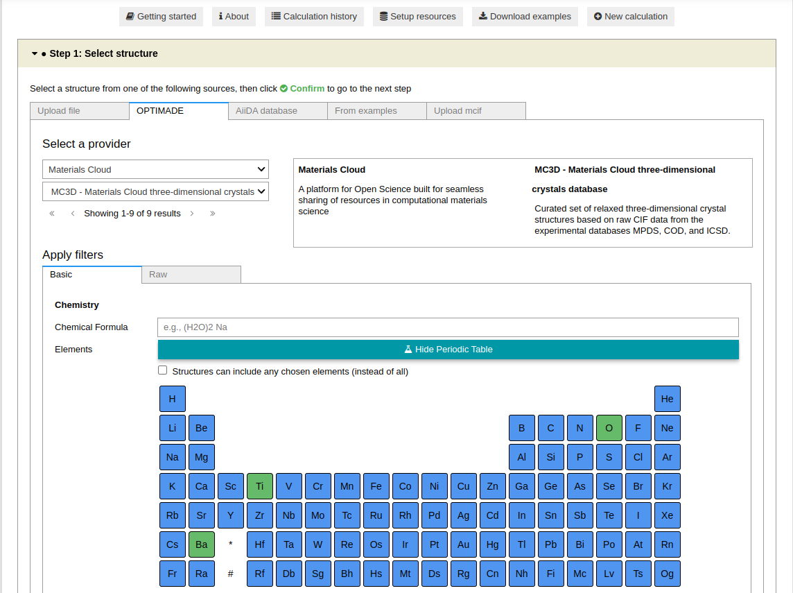
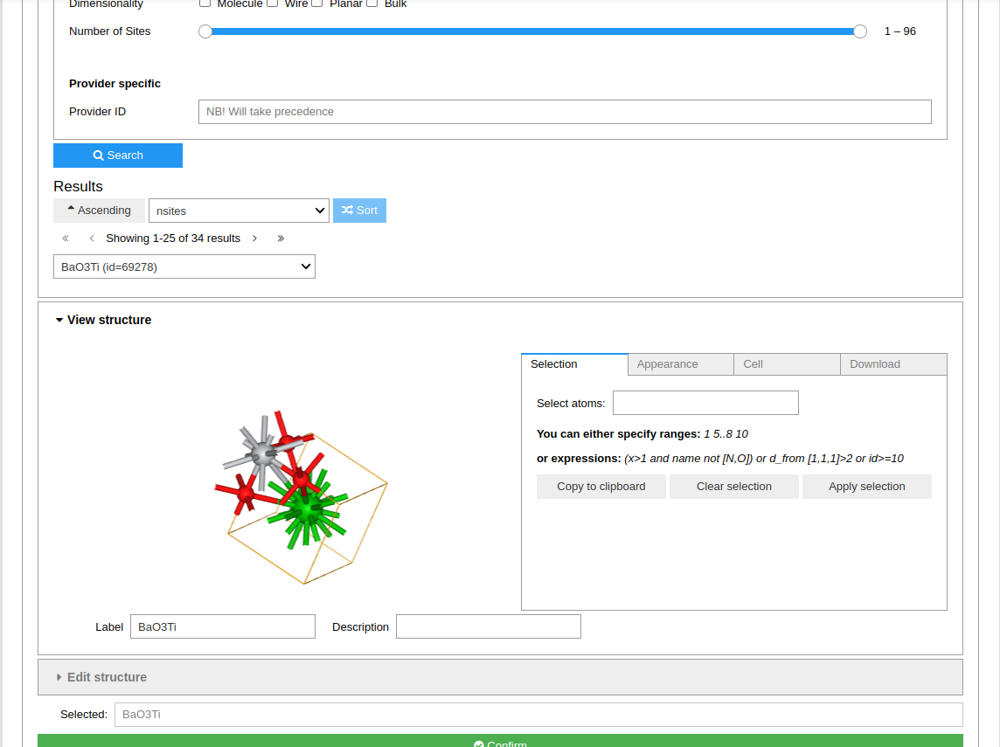
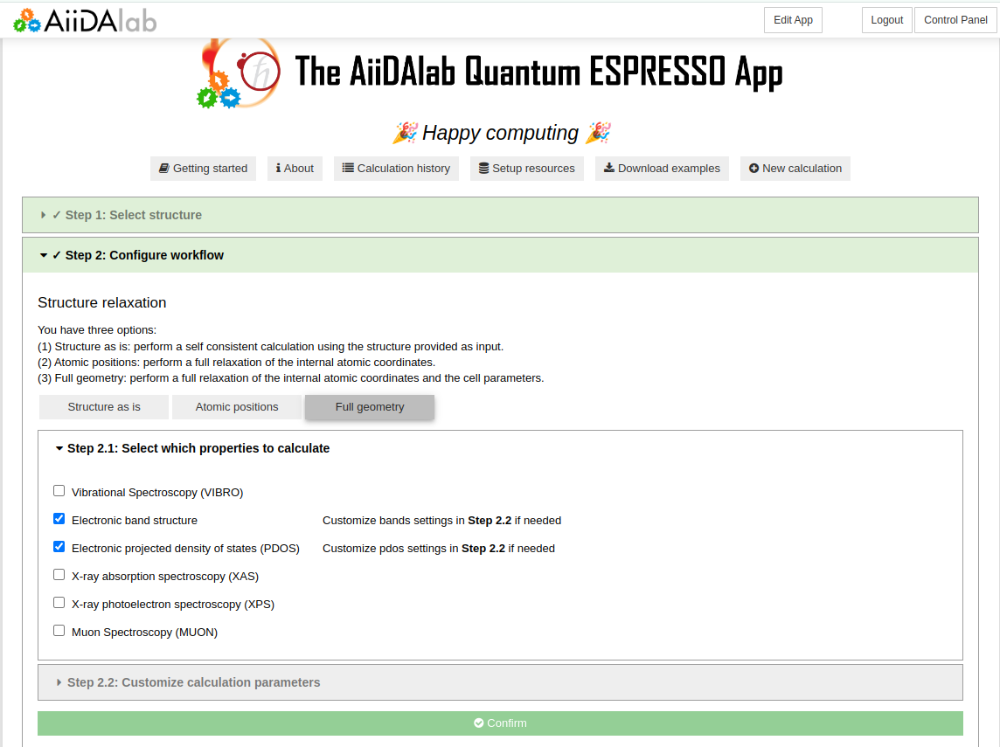
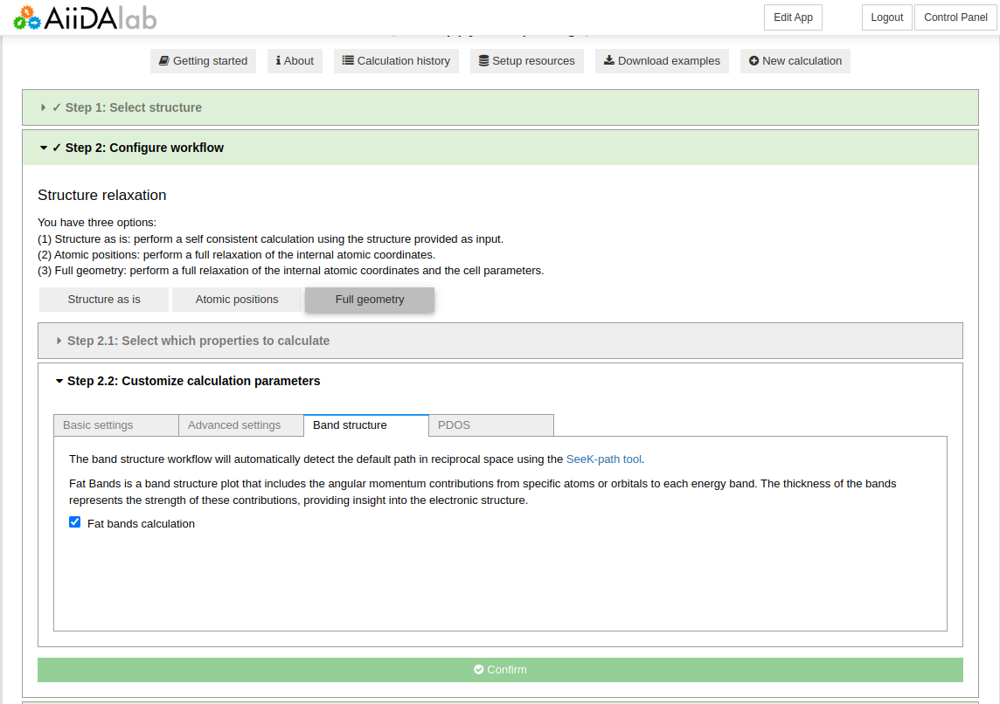
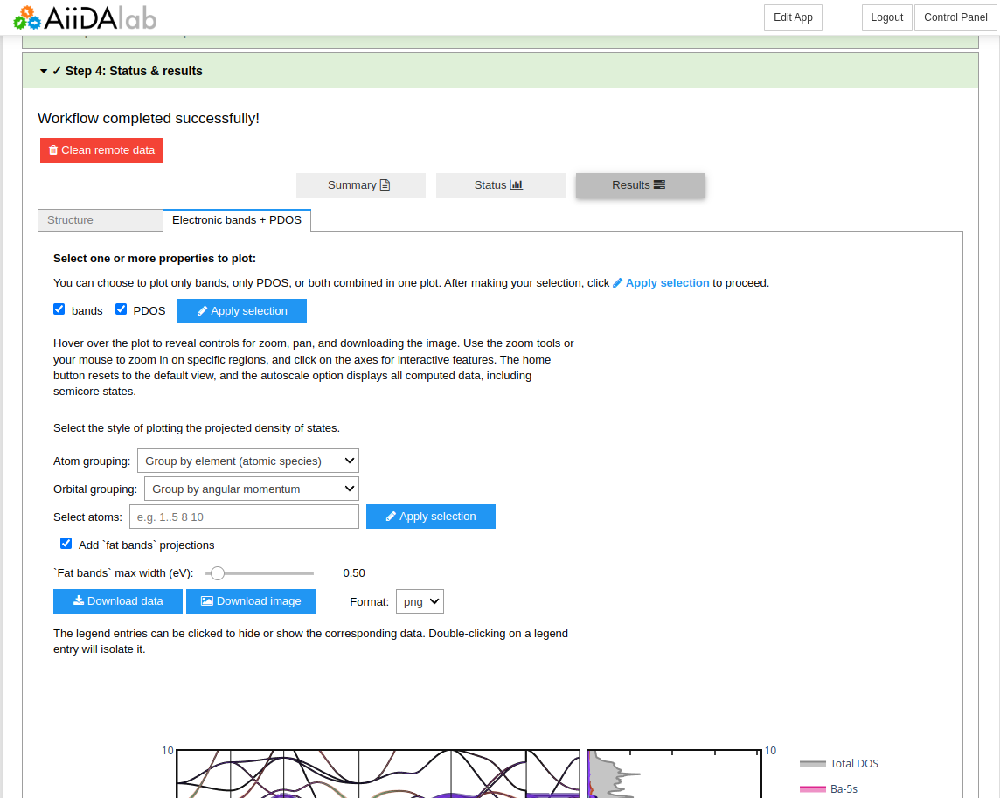
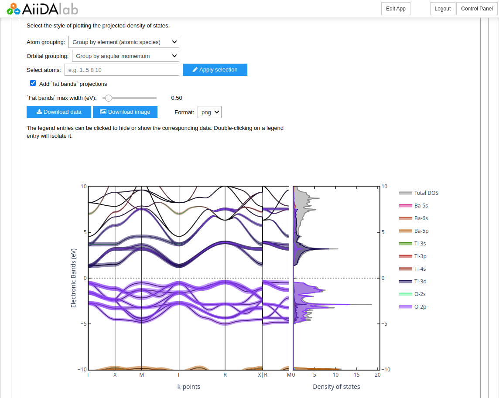

==================================================
How to calculate Electronic band structure and DOS
==================================================

Overview
--------

In the following, we show how to compute the electronic band structure and Projected Density of States (PDOS) of BaTiO3.

Due to the number of calculation steps required, we will need to set up our environment to submit to a remote machine capable of handling the calculation.
Please refer to the relevant :doc:`How-To </howto/setup_computer_code>` section for this procedure.

.. admonition:: Goal

    Obtain the electronic bands and PDOS of BaTiO3 using the Quantum ESPRESSO app.

Start
-----

To start, go ahead and :doc:`launch </installation/launch>` the app, then follow the steps below.

Step 1: Select the structure from the OPTIMADE database
*******************************************************

Open the OPTIMADE tab and select `Materials Cloud` from the first dropdown menu,
and `MC3D` from the second dropdown menu.

Then, in the periodic table, select the elements `Ba`, `Ti`, and `O` to filter the results.
Once done, click on the `Search` button to see the results.

You will see several results. Select the third entry, ``BaO3Ti (id=69278)``, and click on the `Confirm` button.

Step 2: Configure the workflow
******************************

Select `Full geometry` to relax the structure and select `Electronic band structure` and `Electronic projected density of states (PDOS)` as the properties of interest.

.. note::
    We will use the `moderate` protocol for this calculation, as it provides a good balance between accuracy and computational cost. If you have access to a remote machine,
    you can use the `precise` protocol for more accurate results. At variance, the `fast` protocol can be used for a quick (test) calculation.

Open the `Band structure` settings tab in `Step 2.2`, and select `Fat bands calculation` to enable the calculation of the band structure with projected atomic orbitals contributions.

Step 3 - Choose computational resources
***************************************

In `Step 3`, you can select a given `pw.x` code and computer to run the simulations. As mentioned above, we will use `moderate` protocol for this calculation.
If you have access to a remote machine, you can set it up and then use it. Please refer to the relevant :doc:`How-To </howto/setup_computer_code>` section for this procedure.

Then, click the `Submit` button to start the AiiDA workflow.

Step 4: Check the status
************************

While the calculation is running, you can monitor its status as shown in the :ref:`basic tutorial <basic_status>`.
You can view the results once the calculation is finished.

Step 5: Results
***************

Once the calculation is finished, you can access the `Electronic bands + PDOS` tab to view the results.
There are several parameters you can use to tune the plots, e.g. the atomic/orbital grouping to visualize the PDOS.

.. note::
    All the data can be downloaded by means of the corresponding `Download data` button.

You can inspect the interactive plot, for example zooming on specific regions, or selecting specific orbitals to visualize their contributions to the band structure.

Summary
-------

Here, you learned how to submit and visualize basic electronic properties of materials using the Quantum ESPRESSO app.
