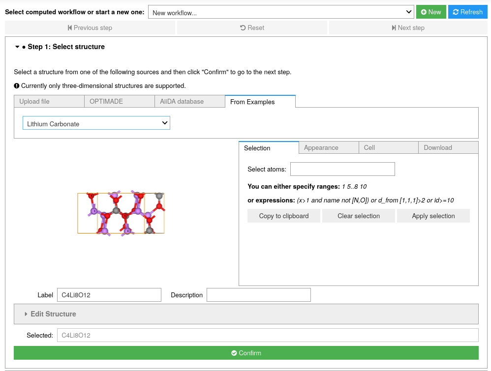
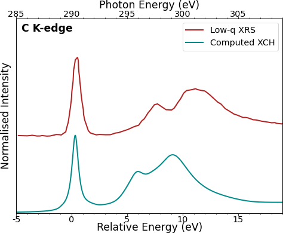
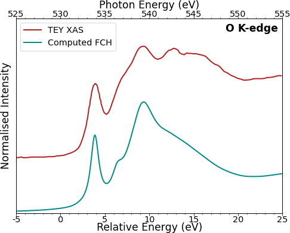
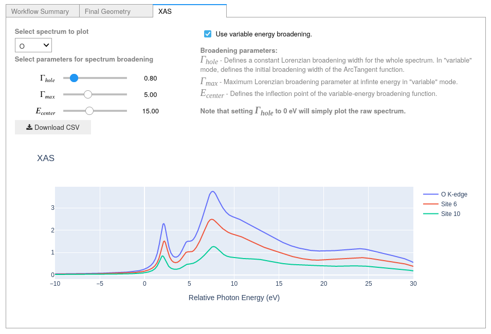

==============================
How to calculate XANES spectra
==============================

Overview
--------

Using the XSpectra module of Quantum Espresso, it is possible to calculate X-ray Absorption Near Edge Spectra (XANES) for many types of systems.
Here we will compute XANES spectra for lithium carbonate (Li\ :sub:`2`\ CO\ :sub:`3`).

Due to the number of calculation steps required, we will need to set up our environment to submit to a remote machine capable of handling the calculation.
Please refer to the relevant :doc:`How-To </howto/setup_computer_code>` section for this procedure.

.. admonition:: Goal

    To submit an XANES calculation with XSpectra and post-process the results

.. note::
    The XAS plugin feature is available in the official AiiDALab-QE App as of pre-release `v24.04.0a1` and upwards.
    See the relevant :doc:`How-To </howto/upgrade_uninstall>` guide on upgrading and remember to tick `include prereleases` when searching for the latest version in the App Manager.

Start
-----

To start, go ahead and :doc:`launch </installation/launch>` the app, then follow the steps below.

Step 1: Select a structure
**************************

Select `Lithium Carbonate` from the `From Examples` tab and click `Confirm`.

Step 2: Configure the workflow
******************************

Select `Full geometry` to relax the structure and set `ElectronicType` to `Insulator`, then select `X-ray absorption spectroscopy (XAS)` as the properties of interest.

For the protocol, select `fast` to quickly produce results, or, if you have enough resources, you can select the `moderate` protocol for increased accuracy.

.. tip::
    For this example of Li\ :sub:`2`\ CO\ :sub:`3` changing the **K-points distance** to 0.25 from 0.15 in the `advanced settings` tab while using the `moderate` protocol will speed up calculations without compromising accuracy.

.. note::
    At present the pseudopotential set available for XAS calculations only covers the PBE functional.
    In order to run the workflow: select the `Advanced settings` tab, navigate to `Accuracy and precision`, tick the `Override` box on the right-hand-side and in the dropdown box under `Exchange-correlation functional` select `PBE`.

    .. image:: ../_static/images/XAS_Plugin-Set_Adv_Options-Alt-Annotated-Cropped.png
        :scale: 55 %
        :align: center

Open the `XAS Settings` tab.
Selection of elements for XANES calculations is found below the explanatory text for the core-hole treatment.
You may wish to test different treatments for each element to see how this changes the spectra at a later date, however for this example we will use the default values.

    .. image:: ../_static/images/XAS_Plugin_Setting_Panel-Annotated-Cropped.png
        :scale: 75 %
        :align: center

Tick the boxes for O and C to select these for calculation, then click `Confirm` to proceed.

Step 3 - Choose computational resources
***************************************

As mentioned in the overview, our calculation will require more computational resources than the basic tutorial.
Please make sure to read the relevant :doc:`How-To </howto/setup_computer_code>` section to configure the environment with a remote machine.

Since the workflow uses `xspectra.x` to calculate the XANES spectrum, a code for this will also be required.
When you're done, click `Submit` to submit the calculation.

.. tip::
    `xspectra.x` does not require additional conserdiations for installation or setup compared to `pw.x`, so re-using the configuration for the `pw.x` code and changing the executable & plugin entry point will be sufficient.

.. note::
    As the XSpectra module of Quantum Espresso is not currently able to exploit GPU accelleration, it is strongly recommend to configure this calculation for a non-GPU system if possible.

Step 4: Check the status
************************

While the calculation is running, you can monitor its status as shown in the :ref:`basic tutorial <basic_status>`.
You can view the results once the calculation is finished.

Step 5: Spectrum view and post-processing
*****************************************

Once the calculation is finished, you can view the calculated spectra in the `XAS` tab of the results panel.
You can change which element to view XANES spectra for using the dropdown box in the top left.
Select carbon from the dropdown box.

    .. figure:: ../_static/images/XAS_Plugin_Result_Panel-Carbon-Annotated-Cropped.png
        :scale: 65 %
        :align: center

        XAS result panel for carbon K-edge of Li\ :sub:`2`\ CO\ :sub:`3`.

.. note::
    You should notice that "C K-edge" and "Site 4" are listed in the legend to the right of the plot - this is because all carbon atoms in the structure are symmetrically equivalent and thus will produce the same spectrum.
    The workflow has accounted for this and only calculates the spectrum of the first carbon atom (site number 4 in the structure.)

Immediately below the element selection box are the broadening parameters.
The XANES spectrum returned by the workflow will initially have a Lorentzian broadening of 0.1 eV.
As broadening parameters cannot be calculated from first-principles, we will tune these parameters by hand.
We will first compare to an experimentally-obtained C K-edge spectrum of Li\ :sub:`2`\ CO\ :sub:`3`.

Try changing the first slider (:math:`\Gamma_{hole}`).
This will initially apply a constant Lorentzian broadening for the entire spectrum.
Comparing to the experimental reference for carbon, we can see that it is difficult to effectively re-create the experimental spectrum with a constant Lorentzian broadening scheme.
Setting this to 0 eV will plot the spectrum with no post-processing.

Navigate to the upper center of the XAS panel and tick the box next to `use variable energy broadening`, which will change the behaviour of the broadening tools to use an arctangent-like function commonly used for broadening XANES spectra (see `Calandra & Bunau (2013)`_\ [1]_ for further discussion).
Set the three sliders in the following configuration:

* :math:`\Gamma_{hole} = 0.3`
* :math:`\Gamma_{max} = 5.0`
* :math:`E_{center} = 15`

The resulting spectrum should now more closely resemble the features seen in the experimental example:

    Carbon K-edge XRS (low-q)\ [2]_ of Li\ :sub:`2`\ CO\ :sub:`3` compared to the XANES dipole computed with the XCH approximation.
    Note that computed and experimental spectra are aligned according to the first peak of the signal in this case.

.. tip::
    For advice with parameter tuning:

    * :math:`\Gamma_{hole}` sets the initial Lorentzian broadening value up to the Fermi level (:math:`E_{F}`, where :math:`E_{F} = 0` eV on the relative energy scale used here). The natural linewidth of the core-hole (if known) typically provides a good reference value (`reference for atomic numbers 10-110`_).
    * :math:`\Gamma_{max}` sets the "sharpness" of the s-curve of the function - lower values give a smoother change at the inflexion point, while higher values cause the broadening to increase more quickly at the inflexion point.
    * :math:`E_{center}` sets the energy position of the inflexion point of the function.

   The variable energy function (:math:`\Gamma(\Omega)`) and its parameters can be visualised in the following plot (from Fig.1 of `Calandra & Bunau (2013)`_\ [1]_):

    .. image:: ../_static/images/Calandra_Bunau-PRB-205105-2013-gamma_func_plot.png
        :scale: 33 %
        :align: center

Next, select the oxygen K-edge spectrum using the dropdown box in the upper left.
With the broadening scheme used for carbon, the spectrum should already resemble the experimental spectrum quite well, though you may try to tune the parameters further if desired - particularly increasing the initial broadening (:math:`\Gamma_{hole}`):

    O K-edge total electron yield (TEY)\ [3]_ XAS spectrum compared to the XANES dipole computed with the FCH approximation.
    Here, the broadening scheme used for carbon is modified such that :math:`\Gamma_{hole} = 0.8` eV.
    Note that computed and experimental spectra are aligned according to the first peak of the signal in this case.

In the plot window, you should be able to see three different plots: One for the full O K-edge and one for each of the two symmetrically-inequivalent oxygen atoms.
The component spectra in each case are first normalised, then the intensities are scaled according to the site multiplicity.

Click on a spectrum in the legend to show/hide it in the viewer.
Click and drag a box over the plot area to zoom in to the selected region.
Double-click to zoom out to the full spectrum.

Finally, click on the "Download CSV" button to the upper left of the plot area to download a CSV file of the XAS plots for the selected element in order to export the spectrum for further analysis.

.. note::
    The CSV file will contain all component spectra for the selected element.
    Any broadening applied to the spectrum *via* the available tools will be applied to the data in the CSV file.
    If multiple inequivalent absorbing atoms are present, the CSV file will contain one column for the total and two for each component:

    * The normalised & weighted spectrum. (with respect to ratio of site multiplicity to total multiplicity)
    * The normalised & un-weighted spectrum.

Summary
-------

Here, you learned how to submit an XANES calculation on a remote machine using the Quantum ESPRESSO app and how to effectively use the post-processing tools.

.. rubric:: References

.. [1] O\. Bunau and M. Calandra, *Phys. Rev. B*, **87**, 205105 (2013) https://dx.doi.org/10.1103/PhysRevB.87.205105
.. [2] E\. de Clermont Gallerande *et al*, *Phys. Rev. B*, **98**, 214104, (2018) https://dx.doi.org/10.1103/PhysRevB.98.214104
.. [3] R\. Qiao *et al*, *Plos ONE*, **7**, e49182 (2012) https://dx.doi.org/doi:10.1371/journal.pone.0049182

.. _reference for atomic numbers 10-110: https://dx.doi.org/10.1063/1.555595
.. _inelastic mean free path: https://dx.doi.org/10.1002/sia.740010103
.. _Calandra & Bunau (2013): https://dx.doi.org/10.1103/PhysRevB.87.205105
.. _PEP 440 version specifier: https://www.python.org/dev/peps/pep-0440/#version-specifiers
