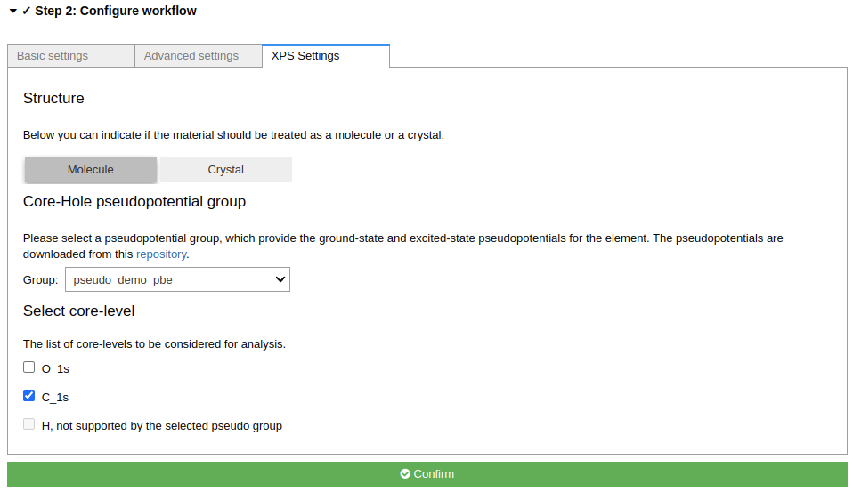
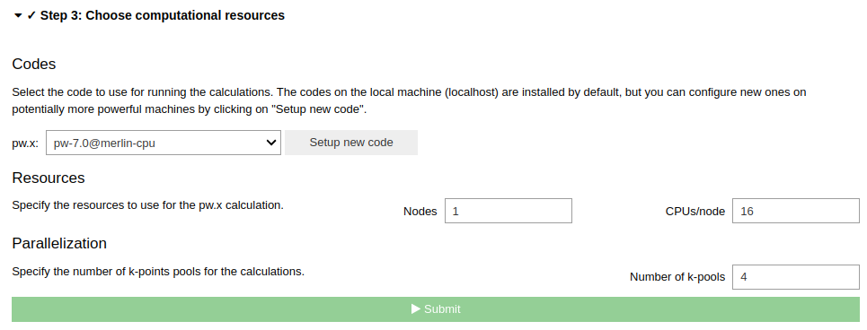

============================
How to calculate XPS spectra
============================

Overview
========
This tutorial will guide you through the process of setting up and running an XPS calculation for Phenylacetylene molecule.

Steps
=====

To start, go ahead and :doc:`launch </installation/launch>` the app, then follow the steps below.

Step 1 Select a structure
--------------------------------
For this tutorial task, please use the `From Examples` tab, and select the Phenylacetylene molecule structure.

Click the `Confirm` button to proceed.

.. figure:: /_static/images/xps_step_1.png
   :align: center

Step 2 Configure workflow
--------------------------------

In the **Basic Settings** tab, set the following parameters:

- In the **Structure optimization** section, select ``Structure as is``.
- Set **Electronic Type** to ``Insulator``
- In the **properties** section, select ``X-ray photoelectron spectroscopy (XPS)``

Then go to the **Advanced settings** tab, navigate to `Accuracy and precision`, tick the `Override` box on the right-hand-side and in the dropdown box under `Exchange-correlation functional` select `PBE`.

.. note::
    At present, core-hole pseudopotentials for Si and O are only available for the PBE functional.

Then go to the **XPS setting** tab and, in the **Select core-level** section, select ``C_1s`` by ticking the appropriate box.

Click the **Confirm** button to proceed.

Step 3 Choose computational resources
---------------------------------------
We need to use a `pw` code on the high-performance computer to run XPS calculation for this system.
Please read the relevant :doc:`How-To </howto/setup_computer_code>` section to setup code on a remote machine.

Then, click the **Submit** button.

Step 4 Check the status and results
-----------------------------------------
The job may take 5~10 minutes to finish if your jobs are running immediately without waiting in the queue.

While the calculation is running, you can monitor its status as shown in the :ref:`basic tutorial <basic_status>`.
When the job is finished, you can view result spectra in the `XPS` tab.

.. tip::

   If the `XPS` tab is now shown when the jobs is finished.
   Click the ``QeAppWorkChain<pk>`` item on top of the nodetree to refresh the step.

Here is the result of the XPS calculation.
You can click the **Binding energy** button to view the calculated binding energies.
You can change which element to view XPS spectra for using the dropdown box in the top left.

.. figure:: /_static/images/xps_step_4_xps_tab.png
   :align: center

One can upload the experimental XPS spectra, and compare to the calculated XPS spectra.
There is a button on the bottom left of the XPS tab to upload the experimental data.
Here is an example of the comparison between the calculated and experimental XPS spectra [1] for the C_1s core level of Phenylacetylene.

.. figure:: /_static/images/xps_step_4_pa_exp.png
   :align: center

The calculated spectra agrees well with the experimental data, underscoring the reliability of DFT calculations.

.. tip::

   One can also read the exact binding energies from the the output of the calculation, by clicking the `outputs` tab on the node tree of the WorkChain, as shown below.

   .. figure:: /_static/images/xps_step_4_output.png
      :align: center

   The DFT calculated binding energies do not include spin-orbit splitting of the core level state.
   We can include the spin-orbit splitting using its experimental value.
   Take `f` orbit as a example, we need subtracting :math:`3/7` of the experimental spin-orbit splitting or adding :math:`4/7` of the DFT calculated value, to get the position of the :math:`4f_{7/2}` and :math:`4f_{5/2}` peaks, respectively. Here is a table of the spin-orbit splitting for different orbitals.

   +----------------+-------------------+-------------------+
   | Orbit          | Substracting      | Adding            |
   +================+===================+===================+
   | 1s             | 0                 | 0                 |
   +----------------+-------------------+-------------------+
   | 2p             |   :math:`1/3`     |  :math:`2/3`      |
   +----------------+-------------------+-------------------+
   | 3d             | :math:`2/5`       |  :math:`3/5`      |
   +----------------+-------------------+-------------------+
   | 4f             | :math:`3/7`       |  :math:`4/7`      |
   +----------------+-------------------+-------------------+

Congratulations, you have finished this tutorial!

Another example
====================
ETFA is commonly used as example for XPS measurements and calculations due to the extreme chemical shifts of its four different carbon atoms. [2]

.. tip::

   One can select the ETFA molecule from the `From Example` tab, and follow the same steps as above to run the XPS calculation for this molecule.

Here is the result of the XPS calculation for the ETFA molecule.

.. figure:: /_static/images/xps_etfa_dft.png
   :align: center

Here is the chemical shift from experiment. [2]

.. figure:: /_static/images/xps_etfa_exp.jpg
   :align: center

The calculated relative shifts align well with the trends observed in experimental data, underscoring the reliability of DFT calculations.
Although there are minor discrepancies in the absolute shift values, this is a recognized limitation stemming from the approximations in the exchange-correlation functional within DFT frameworks. [3]

Questions
=========

If you have any questions, please, do not hesitate to ask on the AiiDA discourse forum: https://aiida.discourse.group/.

References
==========

[1] V. Carravetta, *et al.*, *Chem. Phys.* 264, 175 (2001) https://doi.org/10.1016/S0301-0104(00)00396-7

[2] O. Travnikova, *et al.*, , *Relat. Phenom.* 185, 191 (2012) https://doi.org/10.1016/j.elspec.2012.05.009

[3] B.P. Klein,  *et al.*, , *J. Phys. Condens. Matter* 33, 154005 (2021) https://doi.org/10.1088/1361-648X/abdf00
