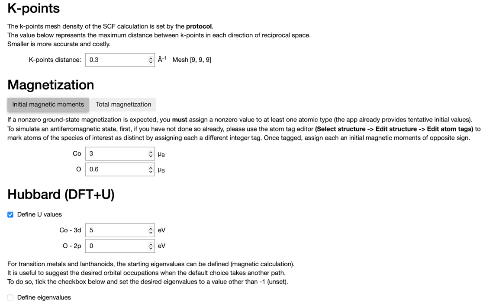
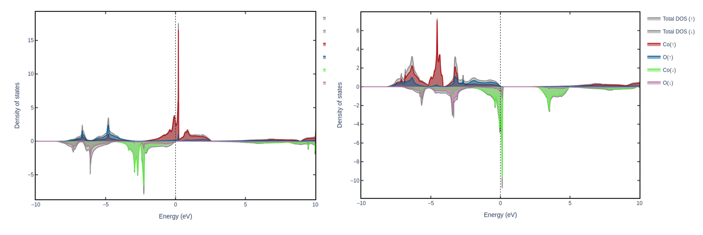
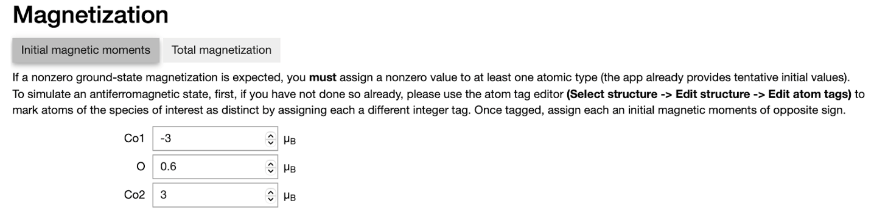
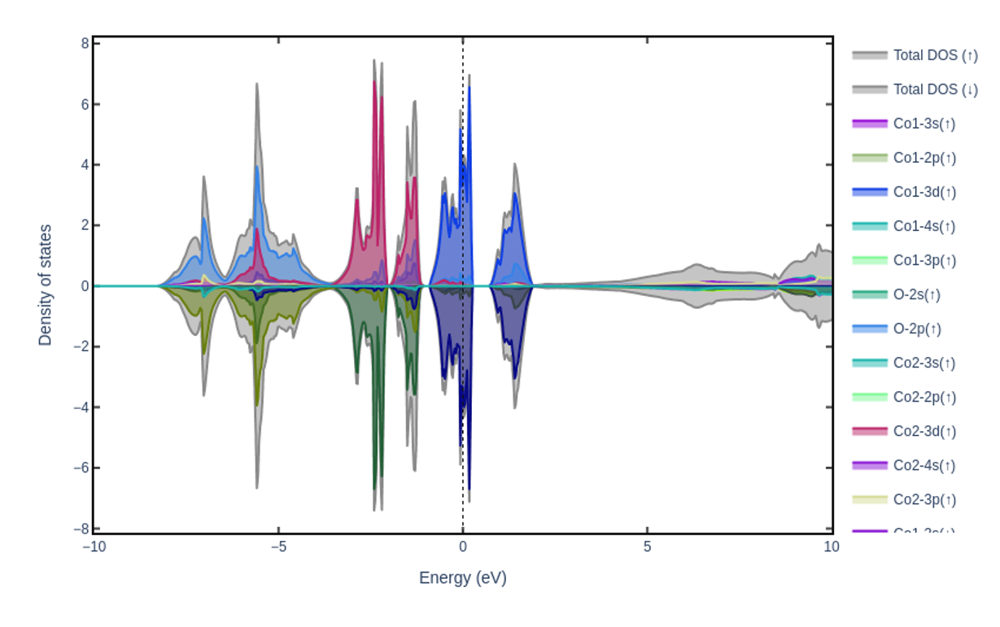

=================
Advanced Tutorial
=================

In this tutorial, we will show how to model a ferromagnetic CoO system and include a Hubbard U correction to improve the description of the electronic structure in highly correlated systems like transition metal oxides.
Finally, you will also learn how to set up a simulation for an antiferromagnetic configuration (but this time, without a Hubbard U).

----

   You can define the initial magnetic moments for each chemical element in your structure.
   It is also possible to set different initial magnetic moments to inequivalent sites of a given chemical element, see the antiferromagnetic example.
   Moreover, you can also define the U values and set them specifically for each chemical element.

   The left plot shows the PDOS of CoO without the inclusion of a Hubbard U correction.
   On the contrary, the right plot presents the PDOS after assigning the Hubbard U of 5 eV to the Co-3d states, which leads to the redistribution of these states.

   To model an antiferromagnetic configuration, you need to set the initial magnetic moments with opposite signs to the two Co atoms in the unit cell.
   You will learn in the in-app guide how to modify your structure to define the two different types of Co atoms!

   The resulting PDOS for the antiferromagnetic configuration of CoO (without Hubbard U).
