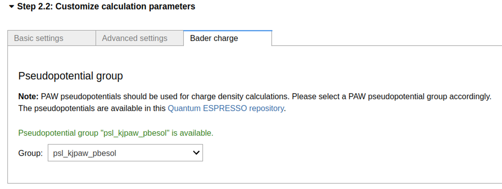
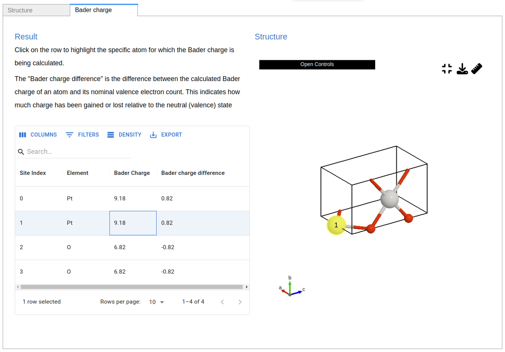

==============
Bader Tutorial
==============

In this tutorial, we will guide you through the process of setting up and submitting a Bader charge calculation using the app.
This will allow you to analyze how charge is distributed across atoms in your structure.
For additional information, refer to the in-app guides available throughout the application.

----

   The setup panel for the Bader charge calculation is simple and user-friendly.
   In most cases, no adjustments are needed. Only modify the pseudopotential group if your use case requires it.

   The results panel displays a table of calculated Bader charges for each atom, alongside the visualized structure.
   You can click on any row in the table to highlight the corresponding atom in the structure view.
