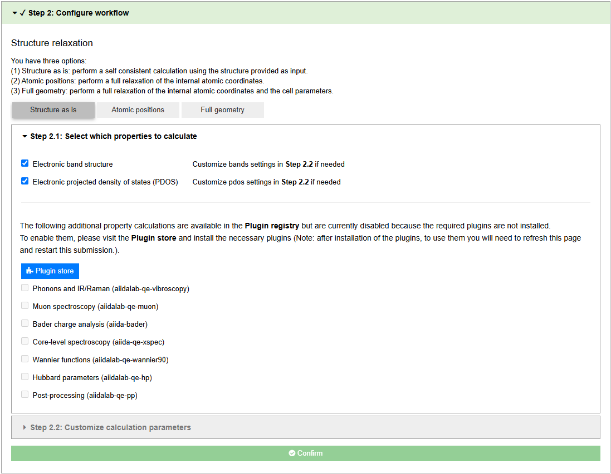
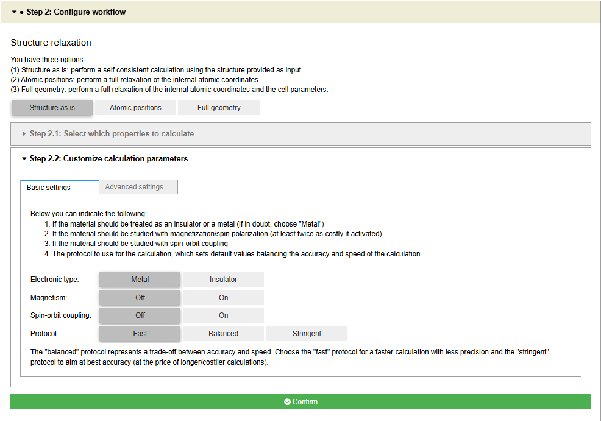

==============
Basic Tutorial
==============

In this tutorial, we will show how to use the basic features of the Quantum ESPRESSO app to run a geometry optimization of bulk Silicon and obtain its band structure.

----

The Quantum ESPRESSO app involves the following steps:

#. :ref:`Selecting a structure <basic:structure>`
#. :ref:`Configuring the workflow <basic:config>`
#. :ref:`Choosing computational resources and submitting the job <basic:resources>`
#. :ref:`Monitoring the status and retrieving results <basic:results>`

The sections below provide a brief overview of each step, along with screenshots from the app.

----

.. _basic:structure:

Structure selection
*******************

You can select a structure from the AiiDA database, upload a custom structure, use the OPTIMADE service to search for a structure across registered databases, or choose from a list of examples.
Once uploaded, you can visualize and modify the structure using the built-in visualization tool.

.. figure:: ../_static/images/in_app_guides/structure_selection.png
   :width: 100%
   :align: center
   :class: img-responsive

   Selecting an initial structure

.. _basic:config:

Workflow configuration
**********************

In the configuration step, you define the workflow by including relaxation (optional) and selecting the desired properties to compute (e.g., band structure, density of states, etc.), as well as specifying parameters for the selected calculations (e.g., protocol, k-point grid, cutoffs, etc.).

   Selecting the properties of interest to compute

   Configuring the calculation parameters

.. _basic:resources:

Resources and submission
************************

In this step, you select the computer and code to use for the calculation, as well as specify the number of nodes and CPUs. When you are ready, you can submit the job.

.. figure:: ../_static/images/in_app_guides/computational_resources.png
   :width: 100%
   :align: center
   :class: img-responsive

   Selecting the computational resources and submitting the job

.. _basic:results:

Monitoring and results
**********************

Once submitted, the app redirects you to the last step, from where you can view a summary of parameters, monitor the status of the workflow, and visualize the results of each calculation as they become available.

   A summary of the workflow parameters.
   You can also download the workflow provenance to explore and/or share your work.

   A live-monitoring tree view of the workflow.
   You can click the calculation nodes (in blue) to view the running job.

   The results of the geometry optimization.
   You can visualize the optimized structure and compare it with the initial one.

.. figure:: ../_static/images/in_app_guides/electronic_results.png
   :width: 100%
   :align: center
   :class: img-responsive

   The results of the electronic structure calculations.
   You can visualize the band structure and density of states, as well as download the data for further analysis.
