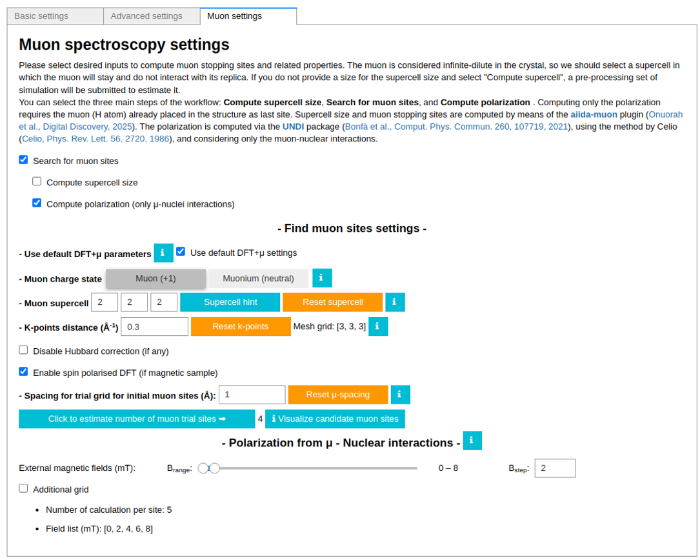
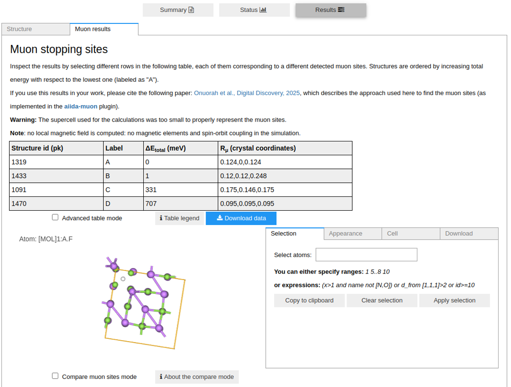
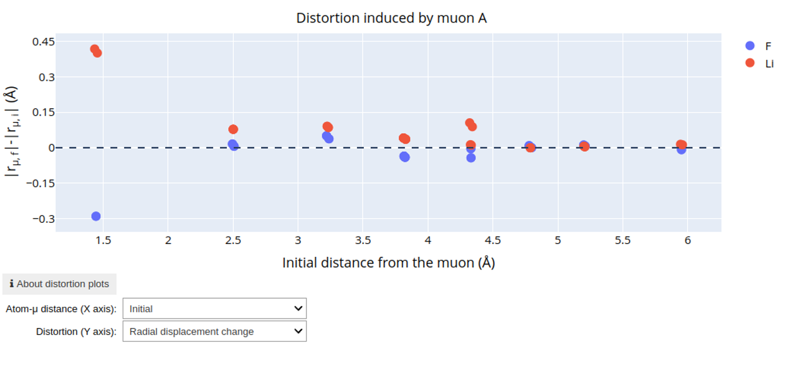
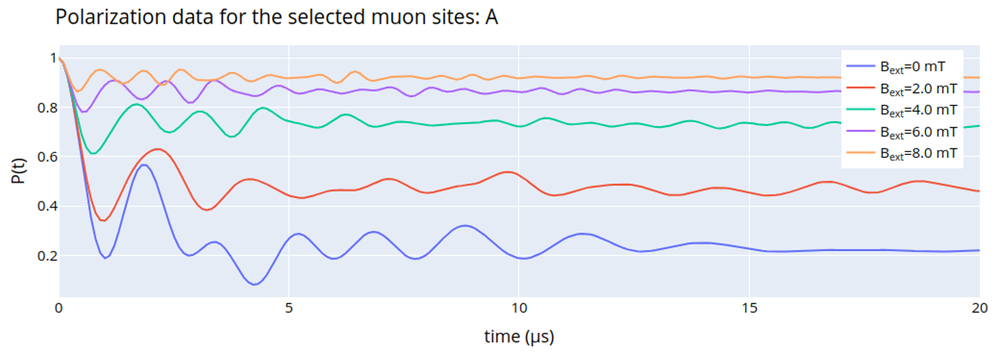

==============
Muons Tutorial
==============

In this tutorial we will show how to setup a calculation for muon resting site search.
We will show the main components of the muon plugin.
For further details, have a look at the corresponding in-app guides of the app.

----

   In step 2, it is possible to set up the muon settings parameters, such as the muon charge state and the hosting supercell.
   Moreover, it is possible to enable the calculation of the muon spin relaxation function (for the candidate sites) for different values of the external magnetic field.

   As the main result, we have the collection of muon stopping sites, ordered in energy, and shown in the structure viewer.

   Moreover, it is possible to investigate the muon-induced distortion of the hosting lattice.

   Eventually, it is also possible to plot the muon spin relaxation function (coming only from nuclear-muon interactions).
