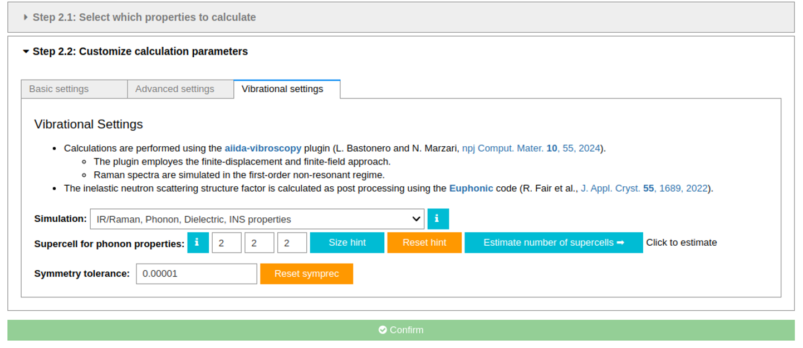
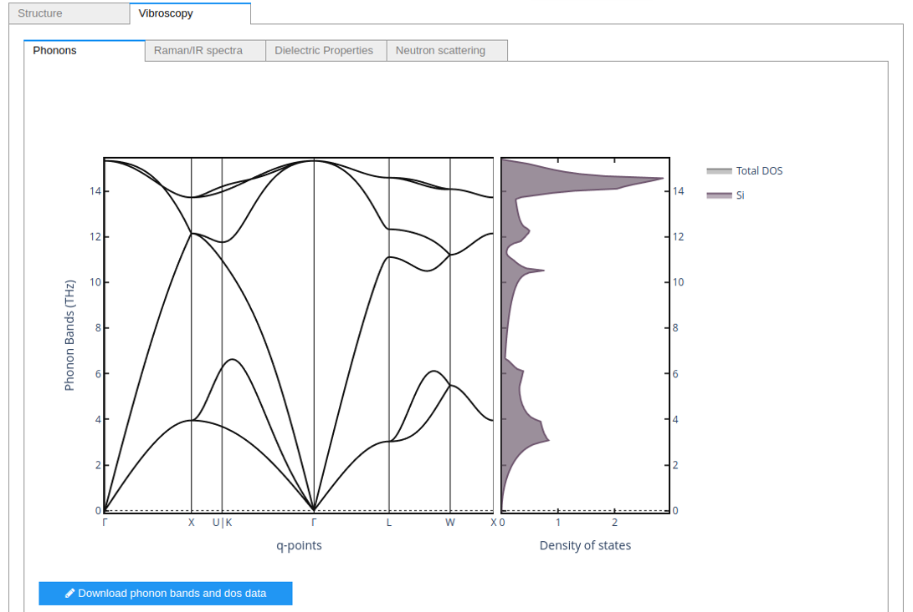
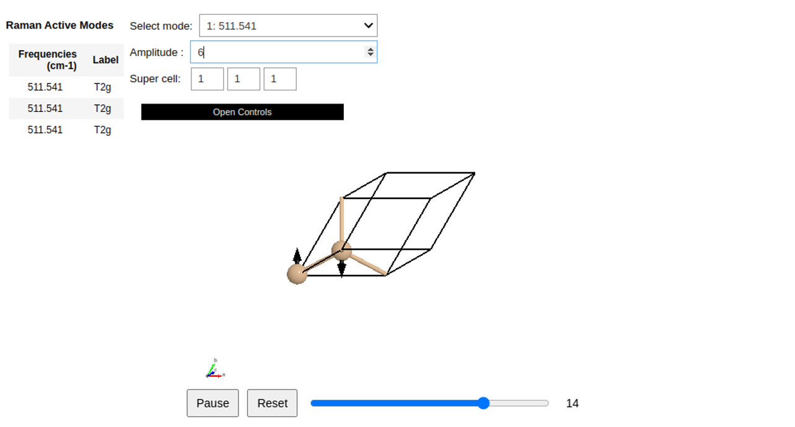
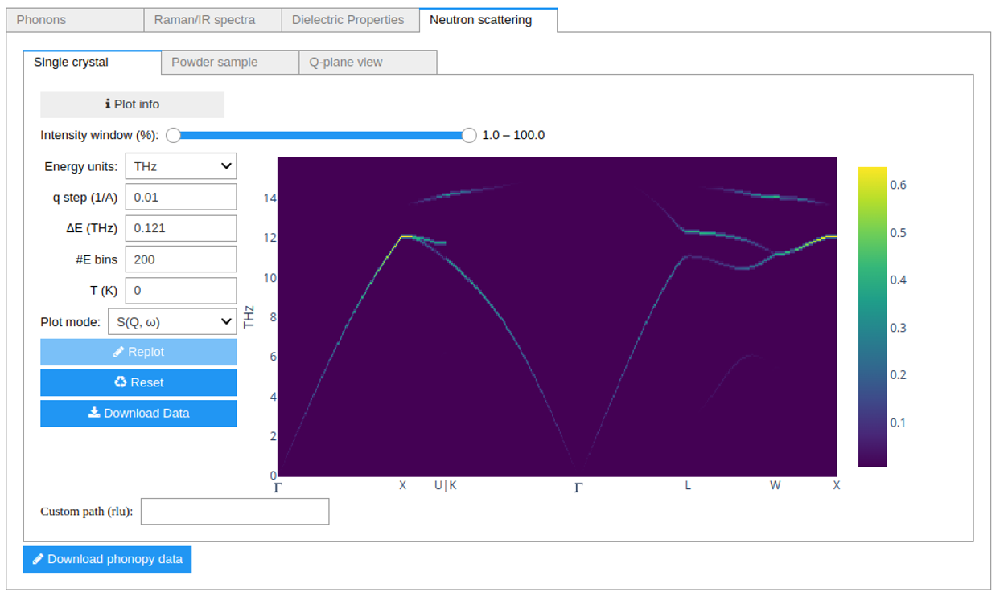

================
Phonons Tutorial
================

In this tutorial we will show how to setup a calculation for vibrational properties.
We will show the main components of the phonon plugin. For further details, have a look at the corresponding in-app guides of the app.

----

   In step 2, it is possible to setup the vibrational settings parameters, such as the type of simulation and the size of the supercell used to compute finite atomic displacements.

   As the first result, we have the phonon band structure and related PDOS (aligned in energy).

   If Raman and IR spectra are computed, it is possible to see the active modes in an animated representation

   The last result panel allows the user to compute the inelastic neutron scattering dynamic structure factor (as computed from phonon results).
